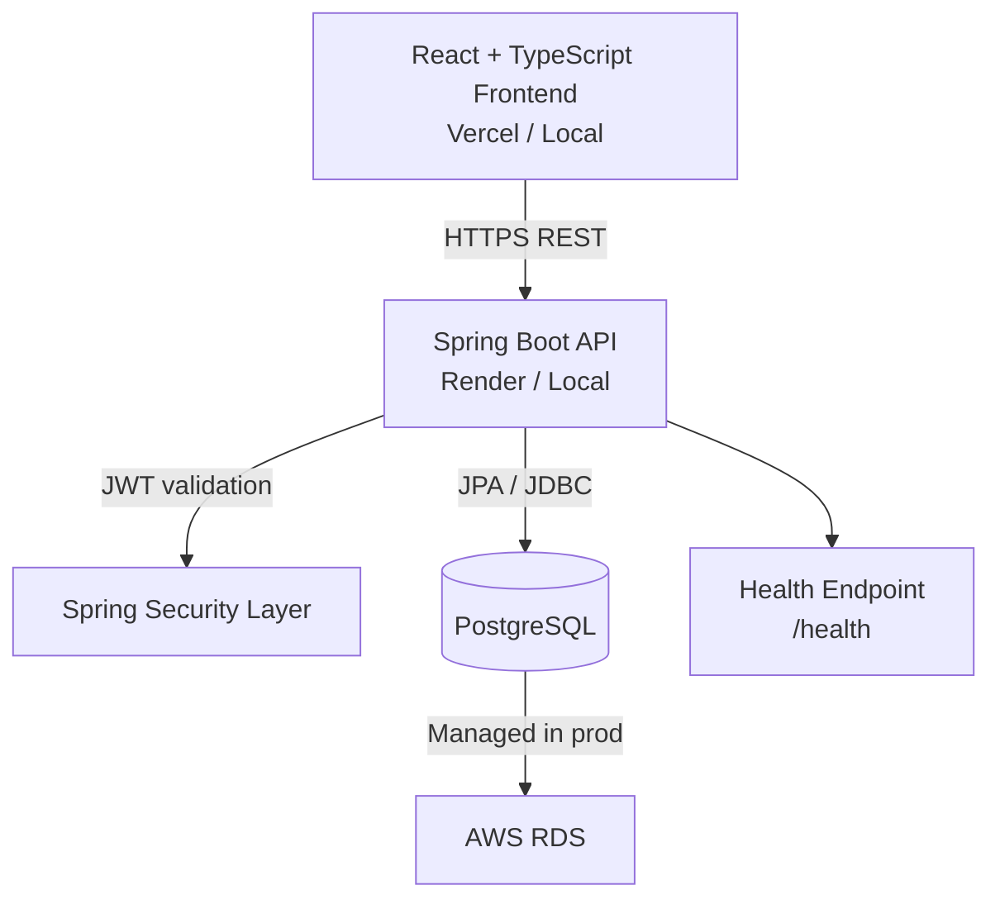

# 🔐 Zero Trust Cloud

Production-style fullstack security platform built around Zero Trust principles.

**Version:** `1.0.0`

This project is designed as a recruiter-facing engineering portfolio: not just a login app, but a realistic security-focused system that combines backend architecture, frontend product thinking, Dockerized development, and production deployment constraints (CORS, env vars, health checks, and cloud readiness).

---

## 📚 Table of Contents

- [⚡ Quick Overview](#-quick-overview)
- [🌟 Why This Project Stands Out](#-why-this-project-stands-out)
- [🔗 Live Demo](#-live-demo)
- [🎬 Demo Video (Placeholder)](#-demo-video-placeholder)
- [🖼️ Screenshots (Placeholders)](#️-screenshots-placeholders)
- [🚀 Product Scope - v1.0.0](#-product-scope---v100)
- [🧰 Tech Stack](#-tech-stack)
- [🛡️ Security Design Principles](#️-security-design-principles)
- [🏗️ Architecture](#️-architecture)
- [🗂️ Repository Structure](#️-repository-structure)
- [💻 Local Development Setup](#-local-development-setup)
- [🐳 Docker Usage](#-docker-usage)
- [🔌 API Endpoints (v1)](#-api-endpoints-v1)
- [🖥️ Terminal Commands Used During the Project](#️-terminal-commands-used-during-the-project)
- [☁️ Deployment Notes](#️-deployment-notes)
- [🧩 Technical Challenges Solved](#-technical-challenges-solved)
- [💼 Why This Project Matters](#-why-this-project-matters)
- [🛣️ Future Updates Roadmap](#️-future-updates-roadmap)
- [🎯 Recruiter-Friendly Highlights](#-recruiter-friendly-highlights)
- [👨‍💻 Author](#-author)

---

## ⚡ Quick Overview

- **Problem:** classic auth-only apps do not model real-world access risk.
- **Approach:** evaluate contextual access requests and return `ALLOW`, `CHALLENGE`, or `DENY`.
- **Result:** a fullstack Zero Trust workflow with security visibility, profile context, and production deployment discipline.

---

## 🌟 Why This Project Stands Out

Most student projects stop at simple authentication.
This project goes further with a practical end-to-end security flow:

- ✅ identity + contextual access verification
- ✅ risk-based decisions (`ALLOW / CHALLENGE / DENY`)
- ✅ security observability (logs, policies, risk insights)
- ✅ profile-aware security context
- ✅ deployment mindset (`Vercel + Render + PostgreSQL + Docker`)

---

## 🔗 Live Demo

- **Frontend (Vercel):** `[LIVE_FRONTEND_URL_HERE]`
- **Backend Health (Render):** `[LIVE_BACKEND_HEALTH_URL_HERE]`
- **API Base URL:** `[LIVE_API_BASE_URL_HERE]`

---

## 🎬 Demo Video (Placeholder)

Add your demo videos here (you only need to replace each placeholder link).

### 🏠 Home Page

`[DEMO_HOME_PAGE_VIDEO_LINK]`

### 🔐 Register / Login

`[DEMO_REGISTER_LOGIN_VIDEO_LINK]`

### 📊 Dashboard

`[DEMO_DASHBOARD_VIDEO_LINK]`

### 📜 Audit Logs

`[DEMO_AUDIT_LOGS_VIDEO_LINK]`

### ⚔️ Attack Simulator

`[DEMO_ATTACK_SIMULATOR_VIDEO_LINK]`

### ⚙️ Settings

`[DEMO_SETTINGS_VIDEO_LINK]`

---

## 🖼️ Screenshots (Placeholders)

- Dashboard: `[SCREENSHOT_DASHBOARD_LINK]`
- Audit Logs: `[SCREENSHOT_AUDIT_LOGS_LINK]`
- Login Page: `[SCREENSHOT_LOGIN_LINK]`
- Attack Simulator: `[SCREENSHOT_ATTACK_SIMULATOR_LINK]`
- Settings Page: `[SCREENSHOT_SETTINGS_LINK]`

---

## 🚀 Product Scope - v1.0.0

### Core Features

- JWT authentication (`register/login`)
- Protected routes in frontend
- Access check engine with contextual fields (resource, action, IP, location, device)
- Risk score + decision response
- Audit logs dashboard
- Interactive risk insights and policy filtering
- Profile management endpoints and UI
- Account deletion with password confirmation

---

## 🧰 Tech Stack

### Backend

- Java 17
- Spring Boot (`Web MVC`, `Security`, `Data JPA`)
- PostgreSQL
- JWT (`jjwt`)
- Maven

### Frontend

- React + TypeScript
- Parcel
- Axios
- React Router

### Infra & Deployment

- Docker / Docker Compose
- Vercel (frontend)
- Render (backend)
- AWS RDS PostgreSQL (production database)

---

## 🛡️ Security Design Principles

- **Stateless JWT authentication:** each protected request is verified without server session state.
- **BCrypt password hashing:** passwords are never stored in plaintext.
- **Context-aware authorization:** access decisions consider action, resource, IP, location, and device context.
- **Least privilege mindset:** protected routes are gated and public endpoints are explicitly scoped.
- **Audit logging:** access decisions are persisted for traceability and review.
- **Separation of concerns:** controllers, services, repositories, DTOs, and frontend services are clearly separated.
- **Risk-based decisions:** deterministic decision model (`ALLOW / CHALLENGE / DENY`) tied to risk scoring.

---

## 🏗️ Architecture

Current request flow:

```text
Browser (React + Parcel)
    |
    | HTTPS
    v
Spring Boot API (JWT, CORS, Zero Trust engine)
    |
    | JDBC
    v
PostgreSQL (local Docker / AWS RDS in production)
```

Mermaid view:



---

## 🗂️ Repository Structure

```text
.
|- src/main/java                # Spring Boot backend
|- src/main/resources           # application properties + SQL migrations
|- frontend-app/src             # React frontend
|- docker-compose.yml           # local PostgreSQL + optional backend container
|- Dockerfile                   # backend image build
|- postman/                     # API collection examples
```

---

## 💻 Local Development Setup

### 1) Start PostgreSQL with Docker

```powershell
Set-Location "C:\Stages\Zero_Trust_Cloud"
docker compose up -d postgres
```

PostgreSQL local mapping:

- host: `localhost`
- port: `5433`
- db: `zero_trust_cloud`
- user: `postgres`

### 2) Start backend locally

```powershell
Set-Location "C:\Stages\Zero_Trust_Cloud"
$env:SPRING_DATASOURCE_URL="jdbc:postgresql://localhost:5433/zero_trust_cloud"
$env:SPRING_DATASOURCE_USERNAME="postgres"
$env:SPRING_DATASOURCE_PASSWORD="postgres"
$env:PORT="5000"
.\mvnw.cmd spring-boot:run
```

### 3) Start frontend locally

```powershell
Set-Location "C:\Stages\Zero_Trust_Cloud\frontend-app"
npm install
npm run dev
```

Notes:

- local frontend should target local backend (`http://localhost:5000`)
- production frontend should target Render backend

---

## 🐳 Docker Usage

Docker is used to standardize local database setup and reduce environment drift.

Benefits:

- same DB baseline for every machine
- faster onboarding
- reproducible local debugging

Useful commands:

```powershell
docker compose up -d postgres
docker compose ps
docker compose logs -f postgres
docker compose down
```

---

## 🔌 API Endpoints (v1)

### Auth

- `POST /auth/register`
- `POST /auth/login`

### Access & Observability

- `POST /access/check`
- `GET /access/scenarios`
- `POST /access/simulate/{scenarioId}`
- `GET /logs`
- `GET /alerts`
- `GET /policies`

### Context & Profile

- `GET /context/me`
- `GET /context/profile`
- `PUT /context/profile`
- `DELETE /context/account`

### Health

- `GET /health`

---

## 🖥️ Terminal Commands Used During the Project

### Backend

```powershell
.\mvnw.cmd -DskipTests compile
.\mvnw.cmd spring-boot:run
.\mvnw.cmd test
```

### Frontend

```powershell
npm run dev
npm run typecheck
npm run lint
npm run build
```

### Docker

```powershell
docker compose up -d postgres
docker compose down
```

### Git

```powershell
git add .
git commit -m "feat: ..."
git push
```

---

## ☁️ Deployment Notes

Current deployment model:

- frontend on Vercel
- backend on Render
- PostgreSQL on AWS RDS

Deployment architecture is intentionally split by responsibility:

- **Frontend (Vercel):** static app delivery and client-side routing
- **Backend (Render):** API runtime, auth logic, and risk engine
- **Database (AWS RDS):** durable managed PostgreSQL data layer

Environment variable strategy:

- frontend uses `VITE_API_URL`
- backend uses `SPRING_DATASOURCE_URL`, `SPRING_DATASOURCE_USERNAME`, `SPRING_DATASOURCE_PASSWORD`, and JWT secret config

CORS and domain alignment:

- allowed origins are explicitly configured for production domains and local development
- credentials + preflight behavior are handled to avoid browser-side auth failures

Health and production checks:

- `GET /health` verifies service and database availability
- deployment validation includes API URL consistency, CORS headers, and database connectivity

Critical production checks:

- correct `VITE_API_URL`
- CORS allowed origins aligned with real domains
- DB env variables correctly set on backend service
- health endpoint returns database `UP`

---

## 🧩 Technical Challenges Solved

- **CORS in production:** aligned allowed origins between Vercel domains and backend API.
- **Frontend/backend URL drift:** stabilized API base URL strategy for local and production contexts.
- **Auth payload consistency:** aligned frontend payload contracts with backend DTO expectations.
- **Password compatibility:** handled credential validation with secure hashing flow.
- **SPA refresh routing on Vercel:** configured rewrite behavior to avoid route 404 on refresh.
- **Local reproducibility:** used Dockerized PostgreSQL to reduce environment differences.

---

## 💼 Why This Project Matters

For internship recruiters, this project demonstrates practical engineering maturity:

- ability to design beyond CRUD into security decisioning workflows
- understanding of production constraints (network, CORS, env vars, deployment boundaries)
- fullstack ownership from UI to API to database and operations
- clear documentation and maintainable code organization

---

## 🛣️ Future Updates Roadmap

### 🎨 UX & Product

- dark/light mode polishing and full theme parity
- improved language switch and complete EN/FR coverage
- richer dashboard widgets and investigation timeline
- notification center and user-defined security thresholds

### 🛡️ Security

- MFA / 2FA
- refresh token rotation and session management
- stronger anomaly detection and behavior baselines
- admin RBAC and audit exports

### ☁️ DevOps / Cloud

- Terraform infrastructure as code
- AWS CloudFront in front of frontend
- backend containerization flow for AWS ECS/Fargate
- CI/CD with automated tests + security checks
- centralized logging and monitoring (CloudWatch / OpenTelemetry)

### 📈 Scalability & Cloud Vision

- move toward immutable infrastructure and environment promotion workflows
- support horizontal API scaling behind load balancing
- improve observability with traces/metrics/log correlation
- introduce cache and async processing patterns for heavier workloads
- evolve deployment pipeline to support zero-downtime rollout strategies

---

## 🎯 Recruiter-Friendly Highlights

- End-to-end fullstack ownership (backend, frontend, infra)
- Security-focused product thinking (not just CRUD)
- Production debugging experience (CORS, auth, env, deployment)
- Clean code documentation (`JSDoc` + `Javadoc`)
- Realistic roadmap from `v1.0.0` to cloud-scale architecture

---

## 👨‍💻 Author

Samy Baouche

- GitHub: `[ADD_GITHUB_LINK]`
- LinkedIn: `[ADD_LINKEDIN_LINK]`
